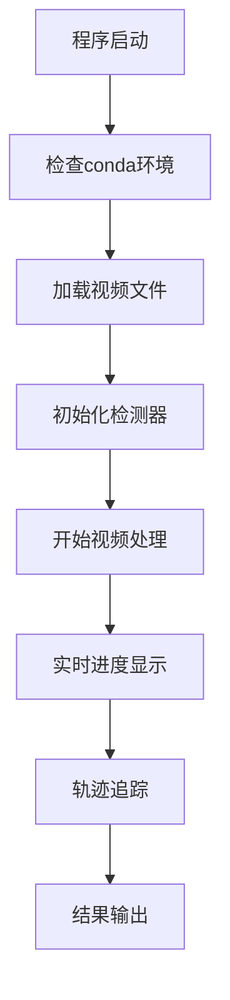

# 视频目标追踪系统需求文档

## 1. 产品概述
基于supervision库开发的视频目标追踪系统，用于对视频中的行人、小轿车和摩托车进行实时轨迹追踪和分析。
系统能够处理多个视频文件，实时显示识别进度，并输出目标的运动轨迹信息。

## 2. 核心功能

### 2.1 用户角色
| 角色 | 注册方式 | 核心权限 |
|------|----------|----------|
| 默认用户 | 直接使用 | 可以运行视频追踪分析，查看结果 |

### 2.2 功能模块
我们的视频目标追踪系统包含以下主要页面：
1. **主程序页面**：视频加载、目标检测配置、追踪算法设置
2. **进度显示页面**：实时显示视频处理进度、检测统计信息
3. **结果输出页面**：轨迹可视化、数据导出功能

### 2.3 页面详情
| 页面名称 | 模块名称 | 功能描述 |
|----------|----------|----------|
| 主程序页面 | 视频加载模块 | 加载video1.mp4和video2.mp4文件，验证文件格式和完整性 |
| 主程序页面 | 目标检测配置 | 配置检测目标类型（行人、小轿车、摩托车），设置检测参数 |
| 主程序页面 | 追踪算法设置 | 初始化supervision追踪器，配置追踪参数 |
| 进度显示页面 | 实时进度显示 | 在命令行输出当前处理帧数、总帧数、处理速度 |
| 进度显示页面 | 检测统计 | 显示当前检测到的目标数量和类型统计 |
| 结果输出页面 | 轨迹可视化 | 在视频上绘制目标轨迹线和边界框 |
| 结果输出页面 | 数据导出 | 保存处理后的视频文件和轨迹数据 |

## 3. 核心流程
用户运行程序后，系统自动加载video1.mp4和video2.mp4文件，使用supervision库进行目标检测和追踪。处理过程中实时在命令行显示进度信息，包括当前处理的帧数和检测到的目标统计。处理完成后输出带有轨迹标注的视频文件。

## 4. 用户界面设计
### 4.1 设计风格
- 主色调：深蓝色(#1e3a8a)和白色(#ffffff)
- 辅助色：绿色(#10b981)用于成功状态，红色(#ef4444)用于错误状态
- 按钮样式：圆角矩形，3D效果
- 字体：等宽字体用于命令行输出，无衬线字体用于界面文本
- 布局风格：命令行界面为主，简洁明了
- 图标风格：使用简单的ASCII字符和进度条

### 4.2 页面设计概览
| 页面名称 | 模块名称 | UI元素 |
|----------|----------|--------|
| 主程序页面 | 视频加载模块 | 命令行文本输出，显示加载状态和文件信息 |
| 进度显示页面 | 实时进度显示 | 进度条，百分比显示，处理速度指示器 |
| 结果输出页面 | 轨迹可视化 | 视频播放窗口，轨迹线条，目标边界框 |

### 4.3 响应性
系统主要为桌面端命令行应用，支持Windows环境下的终端显示，针对不同分辨率的终端窗口进行适配。